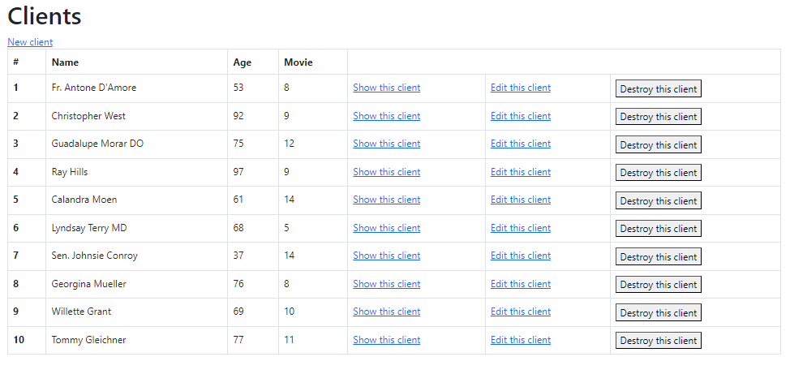
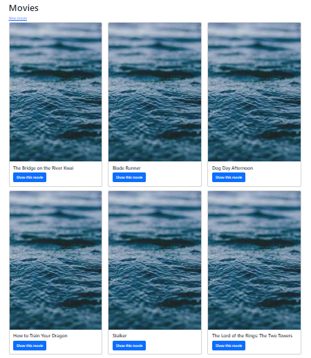

# Título del Proyecto

Proyecto desafío Blockbuster

## Descripción

Este proyecto consiste en una vista de películas y una lista de clientes de un video club, con su edad y el numero de películas arrendadas.

## Visuales

## Empezando 🚀

Estas instrucciones te guiarán para obtener una copia de este proyecto en funcionamiento en tu máquina local para propósitos de desarrollo y pruebas.

### Prerrequisitos 📋

Lista de software y herramientas, incluyendo versiones, que necesitas para instalar y ejecutar este proyecto:

- Sistema Operativo Ubuntu 20.04
- Lenguaje de programación Ruby 3.1.1
- Framework Ruby on Rails
- Base de datos PostgreSQL 14

### Instalación 🔧
Para llevar el proyecto a heroku: 
Pasos para crear el proyecto en heroku
1.-Heroku Login
2.-Heroku create (nota mental, nunca borre el proyecto que ya creó)
3.- en consola ->git push heroku main
4.- Al abrir la aplicacion: dará error 500 
5.- ir a la consola rails y aplicar el siguiente comando: heroku run rails db:migrate

## Despliegue 📦
ir a heroku.com y en el menú Dashboard/Deploy/oppen app 

## Construido Con 🛠️

- [Ruby](https://www.ruby-lang.org/es/) - El lenguaje utilizado
- [Ruby on Rails](https://rubyonrails.org) - El framework web utilizado
- [Ruby gems](https://rubygems.org) - Gestión de dependencias
- [Postgresql](https://www.postgresql.org) - Sistema de base de datos
- [Bootstrap](https://https://getbootstrap.com/) - Framework de CSS

## Contribuyendo 🖇️

Las contribuciones son lo que hacen a la comunidad de código abierto un lugar increíble para aprender, inspirar y crear. Cualquier contribución que hagas es muy apreciada. Por favor, lee el [CONTRIBUTING.md](https://gist.github.com/bpereira74) para detalles sobre nuestro código de conducta, y el proceso para enviarnos pull requests.

## Soporte

Si tienes algún problema o sugerencia, por favor abre un problema [aquí](https://github.com/your/bpereira74/issues).

## Roadmap

Ideas, mejoras planificadas y actualizaciones futuras

para el proyecto actual.

## Versionado 📌

Usamos [Git](https://git-scm.com) para el versionado. Para las versiones disponibles, ve las [etiquetas en este repositorio](https://github.com/your/project/tags).

## Autores ✒️

- **Bárbara Pereira C** - _Trabajo inicial_ - [Brayan Diaz C](https://github.com/bpereira74)

Mira también la lista de [contribuidores](https://github.com/your/project/contributors) que han participado en este proyecto.

## Licencia 📄

Este proyecto está bajo la Licencia XYZ - ve el archivo [LICENSE.md](LICENSE.md) para detalles

